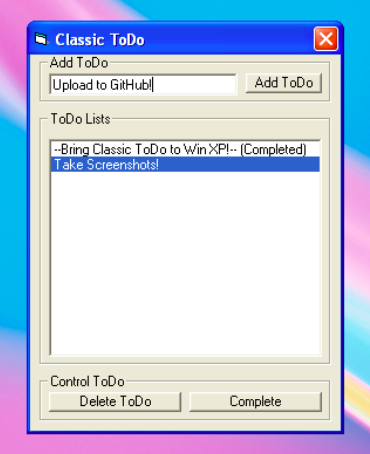

# Classic ToDo

Classic ToDo made with Visual Basic 6 for older Windows

---

### Background

Classic ToDo is a very simple ToDo app made using Visual Basic 6 that could be run in older version of Windows as it doesn't rely on .NET Framework.

This is another series of ToDo app by me ToDo Vista, ToDo7 and Metro ToDo. The aim of this series is to show simple use-cases on each programming language, also to help new programmers to learn making a very simple ToDo application on their favorite programming languages, and also hopefully could help people who need a simple ToDo app but still using old OS (Windows 9.x - Windows 7).

On that note, I'm still in progress exploring other programming languages and make a simple ToDo applications while getting on them, so expect more ToDo apps soon! (feel free to check my repo!)

### Specifications

- 32 bit Windows OS

- 32 bit color mode for convenience

- Few KBs of RAM and ~1 MB HDD space

Notes:

This program will run on Windows 9.x, Windows ME, Windows 2K and NT, Windows XP and up. Theoritically, it could run until Windows 11, but will be tested soon.

Classic ToDo is made using Visual Basic 6, so there are no specific requirements. It also compiles as a single .exe file, so no need to have installers or similar things as there's nothing to register or install. It should be able to run as a portable .exe on any PC.

Not yet tested to run on WINE, but again, theoritically it could run.

### Features

Just a simple ToDo app that can:

- Add ToDo list

- Delete a ToDo

- Mark a ToDo as completed

For now, I didn't have plan to add new features very soon, but the ultimate goal is to make it at least have the same features as my ToDo7. But limitations might apply from the Visual Basic.

### Screenshots

_Pic 1. Main application running on Windows ME_

_Pic 2a, 2b. Simple validations._

_Pic 3. Features include complete todo, delete todo. There's also validation for completing a completed todo._

_Pic 4. Classic ToDo running on Windows XP_

### Download

Check on Release page :)

### Changelogs

##### v.1.0.1

Fix some layout positions (compare screenshot Windows ME vs XP, the XP is 1.0.1)

##### v.1.0.0

Initial compile to .exe, not uploaded to GitHub Releases as for testing purposes

---

Feel free to contribute! :)
